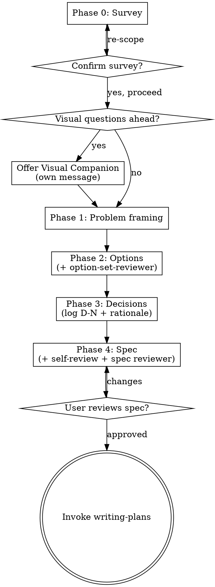

# Brainstorming Ideas Into Designs

Help turn ideas into fully formed designs and specs through natural collaborative dialogue.

Start by understanding the current project context, then ask questions one at a time to refine the idea. Once you understand what you're building, present the design and get user approval.

<HARD-GATE>
Do NOT invoke any implementation skill, write any code, scaffold any project, or take any implementation action until you have presented a design and the user has approved it. This applies to EVERY project regardless of perceived simplicity.
</HARD-GATE>

## Anti-Pattern: "This Is Too Simple To Need A Design"

Every project goes through this process. A todo list, a single-function utility, a config change — all of them. "Simple" projects are where unexamined assumptions cause the most wasted work. The design can be short (a few sentences for truly simple projects), but you MUST present it and get approval.

## Phased Checklist

Brainstorming runs in five phases. Each phase has an explicit gate. You MUST create a task for each phase and complete them in order.

1. **Phase 0 — Survey** — dispatch research-subagent; start decision log; confirm with the human partner before advancing.
2. **Phase 1 — Problem framing** — clarify purpose, constraints, success criteria; capture in decision log.
3. **Phase 2 — Options** — propose 2–3 approaches (visual or text); dispatch option-set-reviewer (advisory).
4. **Phase 3 — Decisions** — human partner picks; record each as `D-N: <decision> — <rationale>` in the decision log.
5. **Phase 4 — Spec** — write spec with a `Decision log:` header back-link; self-review; human-partner review; dispatch spec-document-reviewer.

Reviewers are advisory in Phases 1–3 and gating at Phase 4. The terminal state is invoking `superpowers:writing-plans`. Do NOT invoke any other implementation skill.

## Process Flow

## Phase 0 — Survey

Dispatch a research-only subagent using `skills/brainstorming/prompts/research-subagent-prompt.md`. It produces a one-screen context survey listing existing skills, plans, specs, and prior decisions that touch the topic.

Start a fresh decision log at `docs/superpowers/decisions/YYYY-MM-DD-<slug>.md` using `skills/brainstorming/decision-log-template.md`. Paste or link the survey into Phase 0 of the log.

**Gate:** surface the decision-log path to the human partner and explicitly ask:

> "Survey complete. Decision log started at `<path>`. Ready to proceed to Problem framing (Phase 1)?"

Do not advance until the human partner confirms. Record the decision-log path in session state so downstream phases and `skills/verification-before-completion` can reference it.

**Skip only when** the human partner has already stated the topic is greenfield with no prior work, and confirms skipping.

## Phase 1 — Problem framing

Ask questions one at a time to refine the idea. Prefer multiple-choice when possible. Focus on purpose, constraints, success criteria. Capture results in Phase 1 of the decision log: problem statement, non-goals, constraints.

Before detailed questions, assess scope. If the request describes multiple independent subsystems, flag it and help the human partner decompose into sub-projects — each sub-project gets its own decision log, spec, and plan.

## Phase 2 — Options

Propose 2–3 approaches with trade-offs. Lead with your recommendation and explain why. Record options in Phase 2 of the decision log.

Dispatch the option-set-reviewer using `skills/brainstorming/prompts/option-set-reviewer-prompt.md`. Findings are advisory; present them to the human partner. The brainstorm does not block on review status.

**Optional persona reviewers** — dispatch one or more when the decision warrants extra scrutiny:

- `skills/brainstorming/prompts/personas/skeptic.md` — hard-to-reverse or architecturally committing decisions.
- `skills/brainstorming/prompts/personas/end-user.md` — user-facing surfaces (CLI, UI, API ergonomics, prompts, docs).
- `skills/brainstorming/prompts/personas/ops-security.md` — network, storage, auth, secrets, shell execution, external services.
- `skills/brainstorming/prompts/personas/future-maintainer.md` — architecture-setting or contract-defining decisions likely to be revisited.

Persona reviewers are opt-in. Do not run them by default on small decisions.

## Phase 3 — Decisions

The human partner picks. Capture each choice in Phase 3 of the decision log as `D-N: <decision> — <rationale>`. Capture deferred or dropped options with a one-line reason.

## Phase 4 — Spec

Write the design spec to `docs/superpowers/specs/YYYY-MM-DD-<topic>-design.md` (user preferences override this default). Scale each section to its complexity — a few sentences if straightforward, up to 200–300 words if nuanced. Cover architecture, components, data flow, error handling, testing. Use `elements-of-style:writing-clearly-and-concisely` if available.

**The spec MUST include a header `Decision log:` pointing back to the decision-log file.** Downstream skills (`verification-before-completion`, trace-reviewer) rely on this link.

Design for isolation and clarity — small units with one clear purpose and well-defined interfaces. In existing codebases, include targeted improvements the current work makes necessary; do not propose unrelated refactoring.

Commit the spec. Then self-review with fresh eyes:

1. Placeholder scan — "TBD", "TODO", vague requirements → fix.
2. Internal consistency — do sections contradict each other?
3. Scope check — focused enough for a single plan, or needs decomposition?
4. Ambiguity check — any requirement readable two ways? Pick one.

Update Phase 4 of the decision log with the spec link. Dispatch `skills/brainstorming/spec-document-reviewer-prompt.md`; findings at this stage are gating. Then dispatch `skills/brainstorming/prompts/trace-reviewer-prompt.md` with the decision-log and spec paths as inputs — findings at this handoff are **gating**. Record trace-reviewer output in Phase 4 of the decision log. Then ask the human partner:

> "Spec written and committed to `<path>` with decision log at `<decision-log-path>`. Please review and let me know if you want changes before we start the implementation plan."

If the human partner requests changes, make them and re-run the spec-reviewer. Only proceed once approved.

**Implementation:** invoke `superpowers:writing-plans`. Do NOT invoke any other skill.

## Backward navigation

If the human partner reopens a previously decided phase, do NOT just edit — first enumerate every downstream artifact that may need re-validation:

- Updated problem statement (Phase 1) → options in Phase 2, all decisions in Phase 3, spec sections in Phase 4, plan tasks, verification report.
- Updated option or decision (Phase 2 or 3) → spec sections tied to that decision, plan tasks tied to that spec section, verification rows.
- Updated spec section (Phase 4) → plan tasks and verification rows tied to that section.

Confirm with the human partner before editing. Record the revision in the decision log's Change Log.

## Key Principles

- **One question at a time** - Don't overwhelm with multiple questions
- **Multiple choice preferred** - Easier to answer than open-ended when possible
- **YAGNI ruthlessly** - Remove unnecessary features from all designs
- **Explore alternatives** - Always propose 2-3 approaches before settling
- **Incremental validation** - Present design, get approval before moving on
- **Be flexible** - Go back and clarify when something doesn't make sense

## Visual Companion

A browser-based companion for showing mockups, diagrams, and visual options during brainstorming. Available as a tool — not a mode. Accepting the companion means it's available for questions that benefit from visual treatment; it does NOT mean every question goes through the browser.

**Offering the companion:** When you anticipate that upcoming questions will involve visual content (mockups, layouts, diagrams), offer it once for consent:
> "Some of what we're working on might be easier to explain if I can show it to you in a web browser. I can put together mockups, diagrams, comparisons, and other visuals as we go. This feature is still new and can be token-intensive. Want to try it? (Requires opening a local URL)"

**This offer MUST be its own message.** Do not combine it with clarifying questions, context summaries, or any other content. The message should contain ONLY the offer above and nothing else. Wait for the user's response before continuing. If they decline, proceed with text-only brainstorming.

**Per-question decision:** Even after the user accepts, decide FOR EACH QUESTION whether to use the browser or the terminal. The test: **would the user understand this better by seeing it than reading it?**

- **Use the browser** for content that IS visual — mockups, wireframes, layout comparisons, architecture diagrams, side-by-side visual designs
- **Use the terminal** for content that is text — requirements questions, conceptual choices, tradeoff lists, A/B/C/D text options, scope decisions

A question about a UI topic is not automatically a visual question. "What does personality mean in this context?" is a conceptual question — use the terminal. "Which wizard layout works better?" is a visual question — use the browser.

If they agree to the companion, read the detailed guide before proceeding:
`skills/brainstorming/visual-companion.md`
